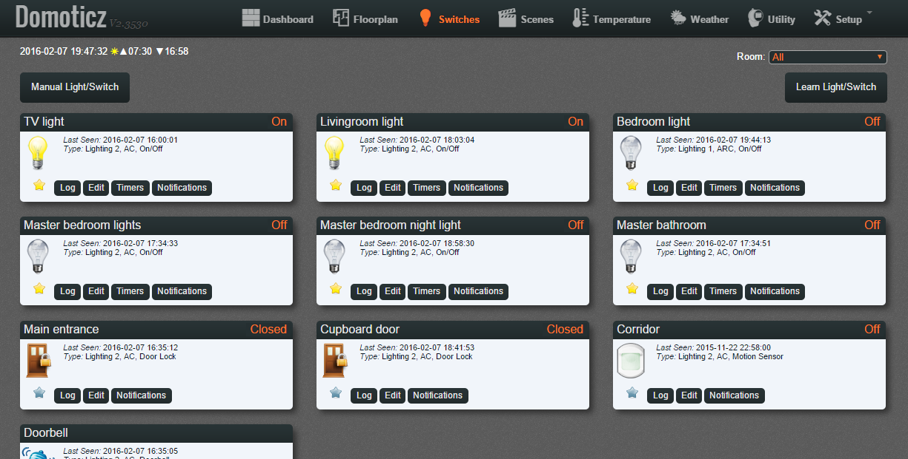

# Domoticz  extensions and themes
#### Theme Techie ####
Based on Nibbleblog theme with the same name https://github.com/dignajar/nibbleblog/tree/master/themes/techie


## Installation
Go to "styles" directory in your Domoticz location, for example:
```
~/domoticz/www/styles/
```

Clone current repo
```
git clone https://github.com/maxwroc/techie.git
```

Go to Domoticz settings Settings -> System Setup -> User Interface -> Theme

Set "techie" team as a default one and click "Apply settings" button.